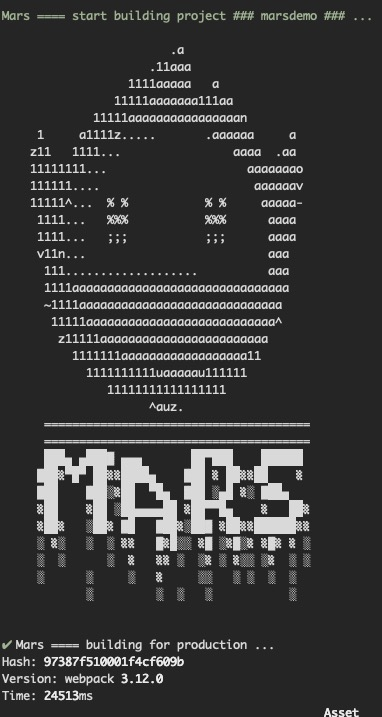
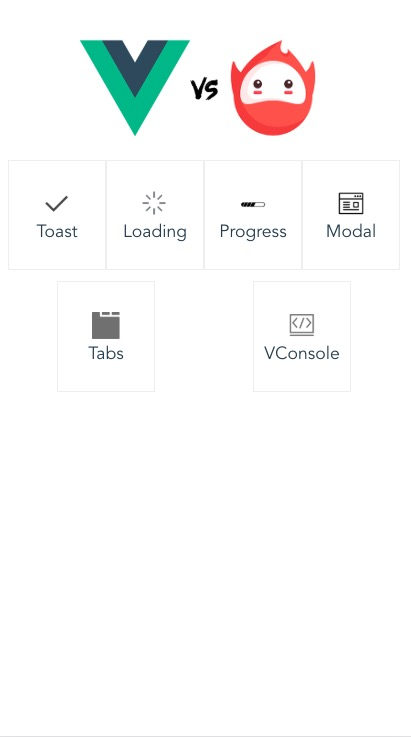
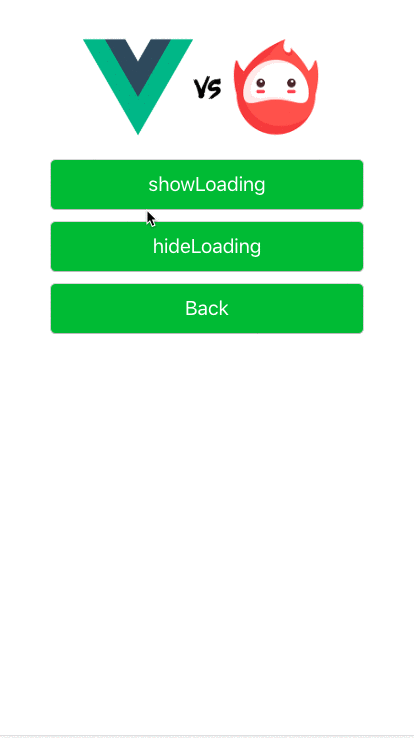
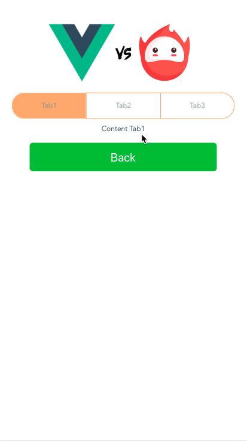

# Mars-Multipages-Seed

> 🚀🚀🚀火星app移动端多页应用框架 A multipages, mobile supported Vue.js skeleton for Mas App

## Description

* __描述：基于Vue的移动端多页应用开发脚手架__
* __公司项目提炼，已做脱敏处理，欢迎下载[唱吧App](https://changba.com/)及[火星直播App](https://mars.changba.com/)__
* __环境搭建：vue-cli + webpack + gulp + axios + sass__

  


## Functions && Components

本项目是一个基于vue-cli和webpack搭建的移动端H5多页应用的脚手架，特点如下：

* [x] 适合多页应用，每个应用单独进行SPA，每个应用单独打包
* [x] 生产环境css提取为单独文件，静态资源文件压缩
* [x] 支持sass等预处理器
* [x] 开发环境热重载
* [x] 支持移动端px2rem-loader，px转rem自适配
* [x] 每个应用支持vue-router简单路由配置
* [x] babel使用transform-runtime代替polyfill，按需加载使用到的babel特性大大减少打包文件体积
* [x] 预置常用babel插件
* [x] 基于WeUI的公共插件toast、loading、modal模态框等，可手动修改和配置
* [x] 封装的axios方法处理网络请求
* [x] 基于模板文件，快速创建create新的独立应用的文件
* [x] gulp相关进行静态资源上传cdn等处理
* [x] 内置组件与插件Demo页面


## Structure

```
├─build # 编译后生成的所有代码、资源（图片、字体等，虽然只是简单的从源目录迁移过来）
├─node_modules # 利用npm管理的所有包及其依赖
├─.babelrc # babel的配置文件
├─.postcssrc.js # postcss的配置文件
├─build.sh # 发布机上编译脚本  （暂未提供）
├─gulpfile.js # gulp脚本，处理cdn上传、静态资源替换等 （暂未提供）
├─package.json # npm的配置文件
├─config # 存放分拆后的webpack配置文件
│   ├─dev.env.js # 开发环境配置
│   ├─index.js # 公共配置
│   └─prod.env.js # 生产环境配置
├─src # 当前项目的源码
│   ├─pages # 各个页面独有的部分，如入口文件、只有该页面使用到的css、模板文件等
│   │  ├─marsdemo # 业务模块
│   │  │  └─marsdemo # 具体页面
│   │  └─... # 其他具体页面
│   ├─assets # 开发过程中的资源文件
│   │  ├─images # 图片文件
│   │  ├─sass # sass文件
│   │  └─logo # logo图片等
│   ├─common # 常用公共文件
│   │  ├─template # 火星活动模板
│   │  └─filter.js # 过滤器
│   ├─components # 常用公共组件
│   │  
│   └─plugins # 各个页面使用到的公共插件
│       ├─toast # toast插件
│       ├─loading # loading插件
│       ├─... # 其他插件
│       └─index.js # 插件入口
│   ├─config # 存放分拆后的webpack配置文件
├─static # 当前静态资源
    ├─js # 公共js
    ├─css # 公共css
│   └─favicon.ico # ico
```

## Dist Structure

打包后的文件目录如下：

```
|-- pages',
   |   |-- marsdemo',
   |       |-- marsdemo.html',
   |       |-- static',
   |           |-- css',
   |           |   |-- marsdemo.842fd4d6.css',
   |           |   |-- marsdemo.842fd4d6.css.map',
   |           |-- js',
   |               |-- manifest.7bdcffd1.js',
   |               |-- manifest.7bdcffd1.js.map',
   |               |-- marsdemo.775dfb41.js',
   |               |-- marsdemo.775dfb41.js.map',
   |               |-- vendor.9030b76c.js',
   |               |-- vendor.9030b76c.js.map',
   |-- static',
       |-- css',
       |   |-- lib',
       |   |   |-- reset.css',
       |   |-- weui',
       |       |-- weui.css',
       |       |-- weui.min.css',
       |-- js',
           |-- lib',
               |-- alert.js',
               |-- callbacks.js',
               |-- deferred.js',
               |-- fastclick.js',
               |-- flexible.js',
               |-- flexible_fix.js',
               |-- jquery.countdown.js',
               |-- jquery.rotate.min.js',
               |-- juicer.js',
               |-- lazysizes.js',
               |-- marquee.min.js',
               |-- mobile-common.js',
               |-- z_alert.js',
               |-- zepto.countdown.js',
               |-- zepto.min.js',
```

## Build Setup

``` bash
# install dependencies
npm install

# create a new mars project based on dev template
npm run create `your project`

# serve with hot reload at 127.0.0.1: port
npm run dev

# build for production with minification
npm run build `your project`

# build for production and view the bundle analyzer report
npm run build --report
```

## Demo 

启动项目，可进入marsdemo项目查看支持的公共组件和插件，目前有基于WeUI编写的公共插件toast、loading、modal模态框等

已marsdemo举例：

### Build



### MarsDemo Init



### MarsDemo Loading



### MarsDemo Tabs




等等，后期组件和功能还会根据业务需求进行增加和逐步完善。
